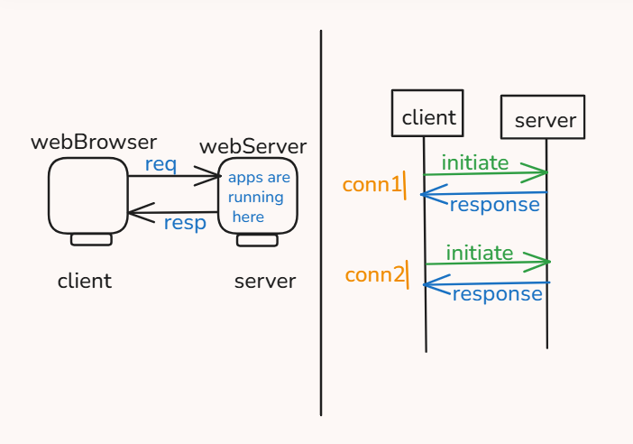

# Client Server Model

1. Client Server

- Client makes request & Server sends response.
- It's typically `one-way communication` per interaction: client initiates, server responds.
- The client always starts the communication (e.g., browser requests a web page) & server just sends response.
- This model is used in most protocols like HTTP, SMTP, and FTP.
- In contrast, WebSocket enables two-way (full-duplex) communication after connection is established.
- [HTTP,SMTP,FTP] = Request-Response (Client initiates) ,
  [WebSocket] = Full-Duplex (Both can send anytime).
  

## HTTP

A traditional network call(HTTP, REST etc.) happens in the following way.
If the client wants to make multiple requests to the server, then multiple connections will be made (in series or in parallel).
A separate connection is created for each request that ends when the response is set.
A typical REQUEST-RESPONSE service looks like this:

## WebSocket

1. The connection is established between the client and the server on a particular port.
2. WebSocket is a real-time, full-duplex communication protocol that allows continuous data exchange between a client and a server over a single TCP connection.
3. Persistent Connection: Once established, the connection stays open.
4. Full-Duplex: Both client and server can send and receive messages at any time.
5. Protocols:
   ws:// → WebSocket over HTTP (unencrypted)
   wss:// → WebSocket over HTTPS (TLS encrypted)
6. Messages can flow from client to server or server to client.
7. No need to establish connection again and again.
8. Either side can close the conn.
